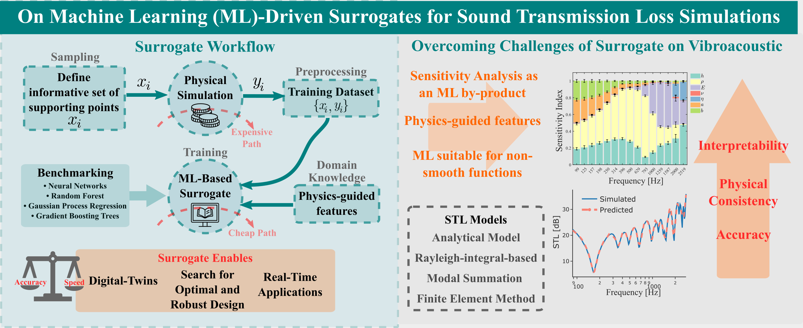

## On Machine Learning-Driven Surrogates for Sound Transmission Loss Simulations

This repository contains the Sound Transmission Loss (STL) datasets and Machine-Learning models described in the paper "On Machine Learning-Driven Surrogates for Sound Transmission Loss Simulations".

Six physics-driven models of STL were used to create the datasets:
* analytical STL solution for infinite plate,
* finite plate STL approximated by correction factor based on Rayleigh-integral,
* analytical Modal Summation (MS) approach,
* MS approach with one-third octave band-average,
* numerical solution using Finite Element Method (FEM) modelled in COMSOL Multiphysics®,
* FEM solution with one-third octave band-average.

Four Machine Learning (ML) algorithms are used to create the surrogates:
* Neural Networks (NN),
* Guassian Process Regressor (GPR),
* Random Forest (RF),
* Gradient Boosting Trees (GBT).
    
The STL variables are the plate thickness *h*, density *ρ*, Young's Modulus *E*, Poisson's ratio *ν*, damping factor *η*, and, for the case of finite plates, the plate width *a* and length *b*. The codes also permit to include the mass density *m*, the bending stiffness *D_R* and the resonance coefficient term *R* as physics guided inputs to the ML models. The ML-driven surrogate outputs are the STL values for each frequency in the *df_freq* files. In addition, Mean Decrease in Impurity (MDI)-based Sensitivity Analysis is performed with RF constructed with Multi-Output Regressor.

### Citation

If you use these datasets and models in your research, please cite:

	@article{Cunha2022,
		author = {Barbara Zaparoli Cunha and Abdel-Malek Zine and Mohamed Ichchou and Christophe Droz and Stéphane Foulard},
		title = {On Machine Learning-Driven Surrogates for Sound Transmission Loss Simulations},
		year = {2022}
	}
